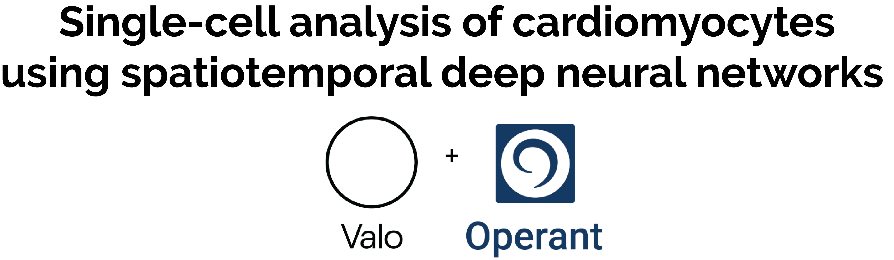
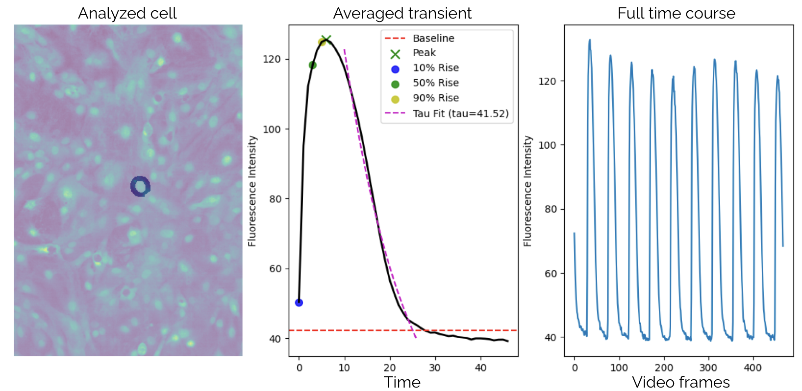
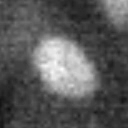
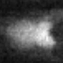
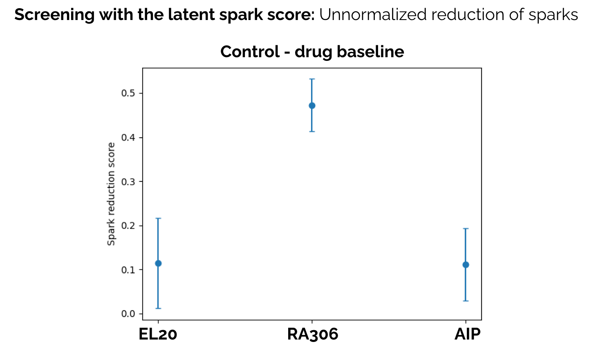
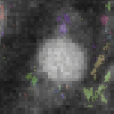
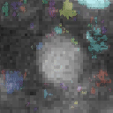

<p align="center">
    
</p>

## This repo contains scripts that do the following:

1. Single cell segmentation and tracking in cardiomyocyte videos. 
<p align="center">
    
</p>

2. Analysis of single-cell calcium kinetics.
<p align="center">
    
</p>

3. Identify cells that spark or not.
<p align="center">
    
    
</p>

4. Use deep neural networks to measure sparks holistically in each cell.
<p align="center">
    
</p>

5. Use deep neural networks to annotate and measure sparks for each cell.
<p align="center">
    
    
</p>

##  Installation

This repo is built on PyTorch and other python packages. GPUs are needed to train models in a reasonable amount of time, but they are likely not necessary for using models to analyze data.

You can install this repo by cloning a local copy then installing all python dependencies.

1. Create a new conda or virtual env (e.g., `conda create --name=ca2 python=3.10`).
2. Activate the environment (e.g., `conda activate ca2`).
3. Visit the (PyTorch website)[https://pytorch.org/get-started/locally/] to find install instructions for your system.
4. Clone this repo `git clone https://github.com/drewlinsley/ca2.git` to your system.
5. Navigate to the repo path in the command line/console, then install all dependencies with `pip install -r requirements.txt`.
6. Download model ckpts `seg3d_epoch_216.pth` and `epoch_122.pth` from (here)[https://drive.google.com/drive/folders/19HZcmxoyEHnBMAEFiGVwhZ3LRiOqd2Lu?usp=sharing] and put them in a folder. I create the local folder `ckpts` with `mkdir ckpts` and put them in there.

##  Getting started

1. We have built the repo to work off of centralized config files that describe where calcium imaging data resides on your machine, and where outputs should be saved to. These config files are saved as `.yaml` files in the `configs` folder. Each script references the same config file like so:

`python <script> --config=configs/<config_name>.yaml`

We have included a template `.yaml` file `configs/template.yaml` that you can adjust for your project.

There is also a global directory/experiment config file in `configs/roi_experiments.py`. Edit this file to describe output directories, experimental keys, and test sets for evaluating models.

2. We need to convert videos from nd2 to a format that's easier to work with for models. Along the way, we also downsample spatially and temporally to make the data easier to model. There is a trade-off with our downsample: we want to make it videos as small (in resolution) as possible to help our models train faster and capture longer-range spatial and temporal dependencies. At the same time, we don't want to downsample to the point where spatiotemporal calcium events like sparks would no longer be detectable. Given the 100FPS sampling rate of the video, we downsample by half and package up data with the following script:

`python preprocess_videos.py --config=configs/template.yaml`

3. Tracking individual cells involves two steps: segmentation then tracking. We will begin by segmenting every nucleus in each video:

`python cell_segmentation.py --config=configs/template.yaml`

4. Once nuclei are segmented, we can track cells, compute statistics on the kinematics of each, and derive videos that show the non-transient activity that our spatiotemporal DNNs are trained to analyze. Run these operations with the command below. Note that `generate_rois` will produce parameter fits, and `save_npy_rois` will save ROI videos as .npy files. Both flags must be true for downstream steps to run.

`python segment_track_and_process.py --config=configs/template.yaml`

This script will generate a spreadsheet with single-cell statistics. The spreadsheet columns are:
- peak: Peak calcium activity
- magnitude: Magnitude of calcium activity (max - min)
- fmax_f0: Maximum calcium activity / baseline activity
- redefined_baseline: Baseline calcium activity (with adjustment to improve robustness)
- rise_t50: Activity of 50% rise
- fall_t50: Activity of 50% fall
- rise_tau: Rise parameter estimate
- fall_tau: Fall parameter estimate
- experiment: Experiment name
- cell: Cell ID
- region: Nucleus=0, Near cytoplasm=1, Far cytoplasm=2

5. After generating ROI videos, we can train models to categorize different experimental manipulations. We have done this on far-cytoplasm ROIs in the `epoch_122.pth` model. We found that this model was able to distinguish between the different experimental conditions by focusing on sparks. Thus, our next step is to use the model to score cell videos according to their sparkiness and even segment and measure individual sparks in videos. The following script will generate models (PLS and NMF) to do this. It will also generate plots to visualize results from these models, which measure the amount of sparks observed in cells in different experimental conditions.

`python decomposition_screen.py --config=configs/template.yaml`

6. We can use the discovered spark representation in our trained spatiotemporal DNNs to annotate videos for sparks. 

`python unsupervised_spark_annotation.py --config=configs/template.yaml`

or 

`python parallel_unsupervised_spark_annotation.py --config=configs/template.yaml`

Both scripts are the same, but the parallel version is faster. These scripts will generate two spreadsheets with single-cell statistics. The spreadsheet defined by `omni_csv_output_path` has information about the average detected spark per cell. The spreadsheet defined by `event_csv_output_path` has information about each detected spark in every cell.

Columns in both spreadshets are:
- file_name: Name of the video file
- cell_number: Cell ID
- spark_score: Spark score
- cell_row: Row of the cell
- cell_col: Column of the cell
- mass: Mass of the spark
- mean: Mean calcium activity of the spark
- magnitude: Magnitude of calcium activity (max - min)
- fwhm: Full width at half maximum of the spark
- duration: Duration of the spark
- radius: Radius of the spark
- spark_row: Row of the spark
- spark_col: Column of the spark
- onset_frame: Onset frame of the spark

## Training Models

Scripts for training models are located in the `src/training` directory. These include:

- `train_seg_model.py`: For training segmentation models
- `train_classification_model.py`: For training classification models

To use these scripts, first download `2023-9-8_control_baseline.npy` and `inner.npy` from (here)[https://drive.google.com/drive/folders/19HZcmxoyEHnBMAEFiGVwhZ3LRiOqd2Lu?usp=sharing] and put them in a folder called `ca2`. Next, run the desired script like so:

```bash
python src/training/train_seg_model.py
```

or

```bash
python src/training/train_classification_model.py
```

or

```bash
python src/training/train_sparkfinder.py
```

These scripts are not integrated with the config files, so look through them to find parameters that you can adjust.

See `spreadsheet_analysis.py` for an example of how to analyze these spreadsheets.

## Model generalization

The models in this repo were trained on a single experimental dataset (and in the case of segmentation, one frame from that dataset). While we expect segmentation and tracking models to generalize relatively well, classification and spark analysis models may require fine-tuning for optimal performance on new experiments. Generalization to different experimental conditions is not guaranteed, and users should validate model performance on their specific datasets or contact Operant for help.

## Issues

```NotImplementedError: The operator 'aten::max_pool3d_with_indices' is not currently implemented for the MPS device. If you want this op to be added in priority during the prototype phase of this feature, please comment on https://github.com/pytorch/pytorch/issues/77764. As a temporary fix, you can set the environment variable `PYTORCH_ENABLE_MPS_FALLBACK=1` to use the CPU as a fallback for this op. WARNING: this will be slower than running natively on MPS.```

Run the scripts with the following flag PYTORCH_ENABLE_MPS_FALLBACK=1. E.g., `PYTORCH_ENABLE_MPS_FALLBACK=1 python ca2_intracellular_ca_seg_3d_test_raw.py --config=configs/template.yaml`.

## Run tests

Several tests can be run with `pytest tests/`
